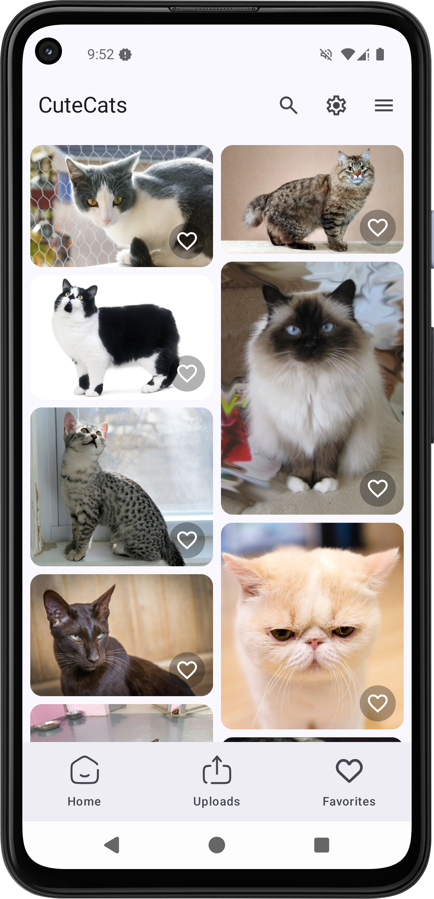
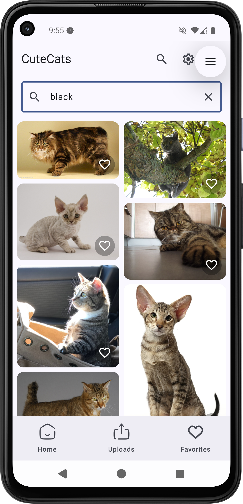
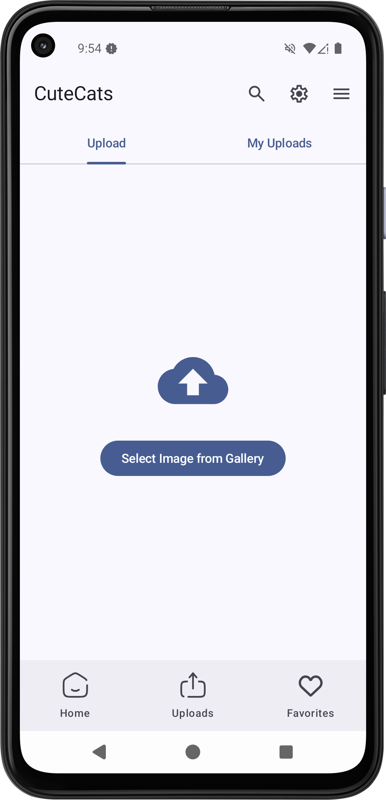
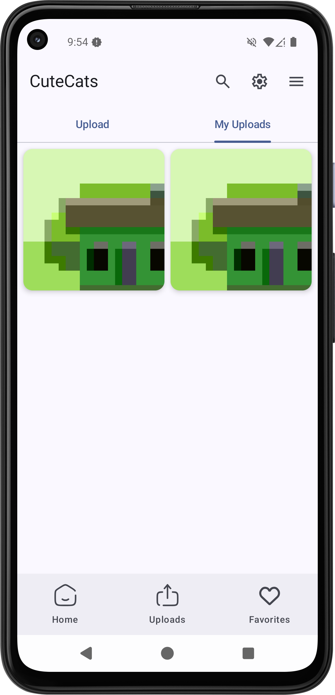
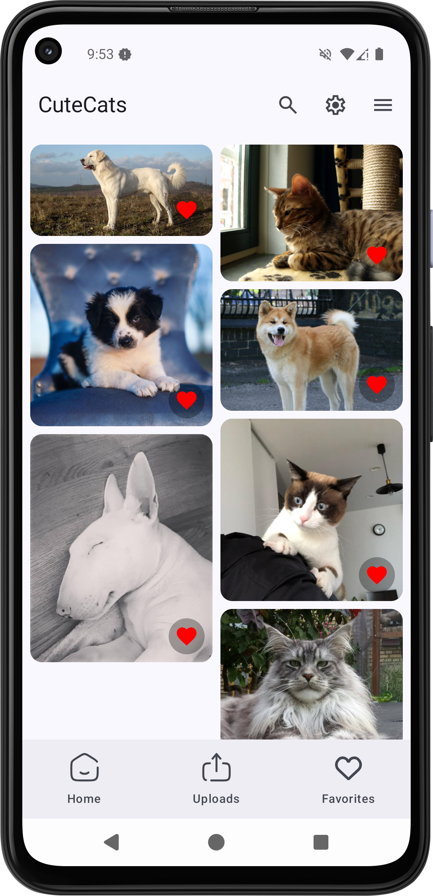

# CuteCats

CuteCats is a modern Android application built with **Jetpack Compose** and **Material UI**, designed for cat enthusiasts to endlessly scroll through adorable cat images, like, save, and upload their own cat photos. The app leverages a robust **MVVM architecture** with **ViewModels**, **Room** for local storage, **Dependency Injection**, and **Supabase** for cloud storage, ensuring a seamless and delightful user experience.

## Features

- **Infinite Cat Image Feed**: Scroll through an endless stream of charming cat images.

- **Like & Save**: Mark your favorite cat images and save them for later viewing.

- **Image Uploads**: Share your own cat photos with the CuteCats community.

- **Advanced Search**: Find specific cat images with powerful search capabilities.

- **My Uploads**: View and manage your uploaded cat images.

- **Favorites**: Access your liked images in a dedicated favorites section.

- **Offline Support**: Browse saved images offline with Room database integration.

- **Cloud Storage**: Securely store and retrieve images using Supabase.


## Screenshots

|   |   |   |   |   |
|---|---|---|---|---|
|Homepage|Advanced Search|Uploads|My Uploads|Favorites|
||||||

## Tech Stack

- **Jetpack Compose**: Modern Android UI toolkit for building dynamic and responsive interfaces.

- **Material UI**: Implements Material Design principles for a polished and consistent look.

- **Kotlin**: Primary programming language for clean, concise, and safe code.

- **MVVM Architecture**: Ensures separation of concerns with ViewModels for robust state management.

- **Room**: Local database for offline storage of favorite images and user data.

- **Dependency Injection**: Utilizes Hilt for efficient and scalable dependency management.

- **Supabase**: Cloud-based storage for secure and reliable image hosting.


## Getting Started

### Prerequisites

- Android Studio (latest stable version)

- Kotlin 1.9.0 or higher

- Supabase account for cloud storage integration

- Minimum SDK: API 21 (Android 5.0 Lollipop)


### Installation

1. **Clone the Repository**:

    ```bash
    git clone https://github.com/username/CuteCats.git
    ```

2. **Set Up Supabase**:

    - Create a Supabase project and obtain your API key and URL.

    - Add the credentials to your local.properties file:

        ```properties
        SUPABASE_URL=your_supabase_url
        SUPABASE_KEY=your_supabase_key
        ```

3. **Build the Project**:

    - Open the project in Android Studio.

    - Sync the project with Gradle.

    - Build and run the app on an emulator or physical device.


### Usage

- **Browse**: Launch the app to start scrolling through cat images.

- **Like & Save**: Tap the heart icon to like an image or save it to your favorites.

- **Upload**: Use the upload feature to share your cat photos.

- **Search**: Utilize the advanced search to find specific images.

- **Offline Mode**: Access your favorites and uploaded images without an internet connection.


## Architecture

CuteCats follows the **MVVM (Model-View-ViewModel)** architecture to ensure a clean and maintainable codebase:

- **Model**: Manages data operations using Room for local storage and Supabase for cloud storage.

- **View**: Built with Jetpack Compose to render dynamic and interactive UI components.

- **ViewModel**: Handles business logic and state management, bridging the gap between the Model and View.


## Contributing

We welcome contributions to make CuteCats even better! To contribute:

1. Fork the repository.

2. Create a new branch (git checkout -b feature/your-feature).

3. Make your changes and commit (git commit -m "Add your feature").

4. Push to the branch (git push origin feature/your-feature).

5. Open a Pull Request.


Please ensure your code follows the project's coding standards and includes relevant tests.

## License

This project is licensed under the GPL-2.0 license- see the LICENSE file for details.

## Acknowledgments

- Thanks to the open-source community for providing amazing tools like Jetpack Compose, Room, and Supabase.

- Special thanks to all cat lovers who inspire this project!
